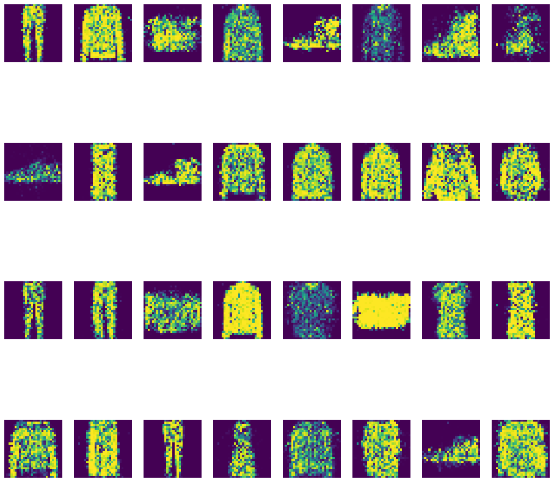

# GAN-Fashion-MNIST
Project to build a GAN for images in the Fashion-MNIST dataset. 

We built a simple GAN using only Dense layers (along with dropout and batchnormalization) for both the generator and the discriminator, and trained it on the Fashion-MNIST dataset for 50 epochs. Following is small sample of images produced by the GAN:

We can see that the GAN has learnt how to create images of a variety off things including shoes, pants, T-shirts etc. However, the images are not of very high quality but this is expected given the simplicity of our architechture. 

Another interesting and perhaps important thing I noticed during this project was that when I used batchnormalization layers (instead of dropout) in the discriminator, the generator almost always experienced _mode collapse_, however swtiching the batchnormalization layers with dropout in the discriminator seems to have solved that problem at least in this case. 